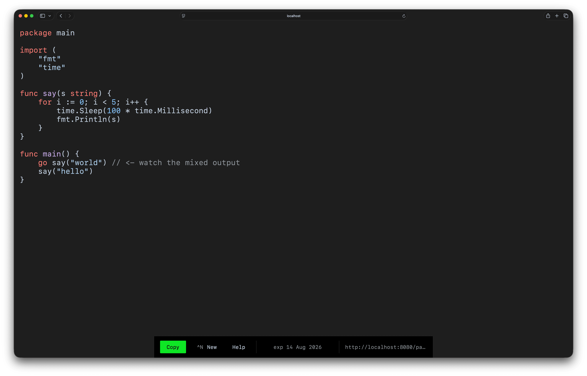

# gopaste


GoPaste is a minimal, high-performance pastebin built with Go, PostgreSQL and Redis.

**Live at [gopaste.surf](https://gopaste.surf)**



## Features

- **Expiration**: keep a paste for an hour, a day, or a week
- **Syntax highlighting**: with automatic language detection
- **Keyboard shortcuts**: `Ctrl+S` to save, `Ctrl+N` for a new paste

## Quick Start

```bash
cp .env.example .env
# open .env and change the password values

make up # runs on http://localhost:8080
```

## Development

```bash
cp .env.example .env
# open .env and change the password values
 
make dev

make run # runs on http://localhost:8080
```

## Testing

```bash
make test         # run all tests
make test-v       # run all tests (verbose)
make cover        # print coverage summary
make cover-html   # open coverage report in the browser
```

## Deployment

Runs on a DigitalOcean droplet using Docker Compose. Caddy handles the reverse proxy and automatic HTTPS. Every push to `main` is tested, built and deployed using GitHub Actions.
